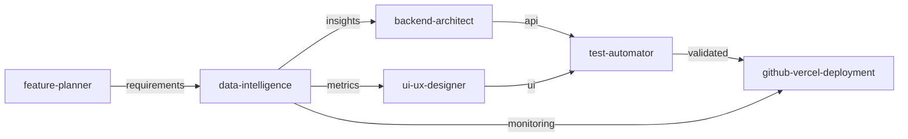
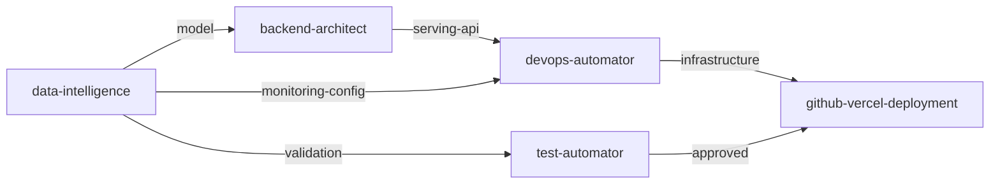
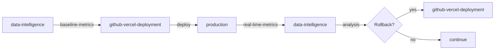

# Agent Handoff and Integration Review

## Executive Summary
After reviewing the agent configuration files, I've identified key integration gaps and handoff issues that need to be addressed for proper orchestration.

## Current Agent Architecture

### 1. Two Orchestrator Systems Detected
- **`.claude/agents/orchestrator.md`**: Comprehensive v2.1 system with 8+ agents
- **`.agents/orchestrator.md`**: Simpler system with 3 agents (data-intelligence, sre-reliability, integration-specialist)

**Recommendation**: Consolidate into single orchestrator system using the comprehensive v2.1 as base.

## Critical Issues Identified

### Issue 1: Missing Data-Intelligence Agent in v2.1 Orchestrator

**Problem**: The comprehensive orchestrator (v2.1) doesn't include the `data-intelligence` agent despite having detailed specifications.

**Impact**: 
- Analytics features cannot be properly orchestrated
- A/B testing workflows are broken
- ML model deployments lack coordination

**Fix Required**:
```yaml
# Add to Available Agents list (line 82 in orchestrator.md)
- **`data-intelligence`** - Analytics, ML models, A/B testing, real-time metrics, data pipelines
```

### Issue 2: Incomplete Handoff Definitions

**Current State**: While agents have internal collaboration patterns defined, the orchestrator lacks explicit handoff mechanisms.

**Required Handoffs**:

#### 1. Data-Intelligence → GitHub-Vercel-Deployment
```yaml
handoff_type: deployment_with_analytics
data_exchange:
  - analytics_configuration
  - performance_baselines
  - rollback_triggers_based_on_metrics
  - monitoring_dashboard_setup
```

#### 2. Feature-Planner → Data-Intelligence
```yaml
handoff_type: requirements_to_analytics
data_exchange:
  - success_metrics_definition
  - a_b_testing_requirements
  - analytics_event_specifications
  - kpi_tracking_needs
```

#### 3. Data-Intelligence → Test-Automator
```yaml
handoff_type: analytics_validation
data_exchange:
  - event_tracking_test_cases
  - statistical_significance_validation
  - performance_impact_tests
  - data_accuracy_verification
```

### Issue 3: Agent Naming Consistency

**Inconsistencies Found**:
- GitHub-Vercel-Deployment agent correctly named in orchestrator
- Data-Intelligence agent missing entirely
- Some agents use underscores, others use hyphens

**Standard Naming Convention**:
- Use hyphens for all agent names: `data-intelligence`, `github-vercel-deployment`, `backend-architect`

## Recommended Integration Workflows

### 1. Analytics-Driven Feature Development


### 2. ML Model Deployment Pipeline


### 3. Deployment with Business Metrics Monitoring


## Quality Gates for Agent Handoffs

### 1. Pre-Handoff Validation
```typescript
interface HandoffValidation {
  from_agent: string
  to_agent: string
  required_data: string[]
  quality_checks: {
    data_completeness: boolean
    format_validation: boolean
    schema_compliance: boolean
    business_rules_met: boolean
  }
  handoff_approved: boolean
}
```

### 2. Data Exchange Protocol
```typescript
interface AgentDataExchange {
  handoff_id: string
  timestamp: string
  from: {
    agent: string
    task_id: string
    deliverables: any[]
  }
  to: {
    agent: string
    expected_inputs: string[]
    task_template: string
  }
  validation: {
    schema_version: string
    checksum: string
    quality_score: number
  }
}
```

## Implementation Priorities

### Priority 1: Update Orchestrator (IMMEDIATE)
1. Add `data-intelligence` to available agents list
2. Update capability matrix to include analytics capabilities
3. Add data-intelligence error patterns to error resolution engine

### Priority 2: Define Handoff Protocols (HIGH)
1. Create explicit handoff patterns for all agent pairs
2. Implement validation gates at handoff points
3. Add handoff monitoring and logging

### Priority 3: Create Specialized Workflows (MEDIUM)
1. Analytics-driven feature development workflow
2. ML model deployment pipeline
3. A/B testing orchestration flow
4. Real-time monitoring integration

## Testing Strategy

### 1. Unit Tests for Handoffs
```javascript
describe('Agent Handoffs', () => {
  test('Data-Intelligence to GitHub-Vercel handoff includes analytics config', () => {
    const handoff = orchestrator.createHandoff(
      'data-intelligence',
      'github-vercel-deployment',
      analyticsFeatureData
    )
    
    expect(handoff.data).toHaveProperty('analytics_configuration')
    expect(handoff.data).toHaveProperty('monitoring_dashboard')
    expect(handoff.data).toHaveProperty('rollback_triggers')
  })
})
```

### 2. Integration Tests for Workflows
```javascript
describe('Analytics Workflow', () => {
  test('Complete analytics feature development flow', async () => {
    const result = await orchestrator.executeWorkflow(
      'analytics_driven_feature_development',
      { feature: 'user_behavior_dashboard' }
    )
    
    expect(result.agents_involved).toContain('data-intelligence')
    expect(result.deliverables).toContain('analytics_dashboard')
    expect(result.deployment.monitoring).toBe('configured')
  })
})
```

### 3. End-to-End Validation
```javascript
describe('E2E Agent Orchestration', () => {
  test('ML model deployment with monitoring', async () => {
    const deployment = await orchestrator.deployMLModel({
      model: 'recommendation_engine',
      monitoring: 'real_time',
      rollback_threshold: 0.15
    })
    
    expect(deployment.status).toBe('success')
    expect(deployment.monitoring_active).toBe(true)
    expect(deployment.rollback_configured).toBe(true)
  })
})
```

## Monitoring and Metrics

### 1. Handoff Success Metrics
- Handoff completion rate: Target > 99%
- Data validation success: Target > 99.5%
- Average handoff time: Target < 500ms
- Quality score at handoff: Target > 95%

### 2. Workflow Efficiency Metrics
- End-to-end completion time
- Agent utilization balance
- Parallel execution efficiency
- Error recovery success rate

### 3. Business Impact Metrics
- Feature deployment velocity
- Analytics implementation coverage
- A/B test execution rate
- ML model deployment frequency

## Action Items

- [ ] Update `.claude/agents/orchestrator.md` to include data-intelligence agent
- [ ] Standardize agent naming conventions across all files
- [ ] Implement handoff validation framework
- [ ] Create unit tests for critical handoffs
- [ ] Add monitoring for handoff success rates
- [ ] Document handoff data schemas
- [ ] Create workflow templates for common scenarios
- [ ] Set up alerts for handoff failures
- [ ] Implement handoff retry logic
- [ ] Create handoff debugging tools

## Conclusion

The agent system has strong individual components but lacks proper integration at the orchestration level. The primary issues are:

1. **Missing data-intelligence agent** in the main orchestrator
2. **Undefined handoff protocols** between agents
3. **Lack of validation** at handoff points

Implementing the recommended fixes will enable:
- Seamless analytics-driven development
- Proper ML model deployment pipelines
- Business metrics-based deployment validation
- Automated rollback based on KPI degradation

The system will be significantly more robust with these integrations properly defined and tested.