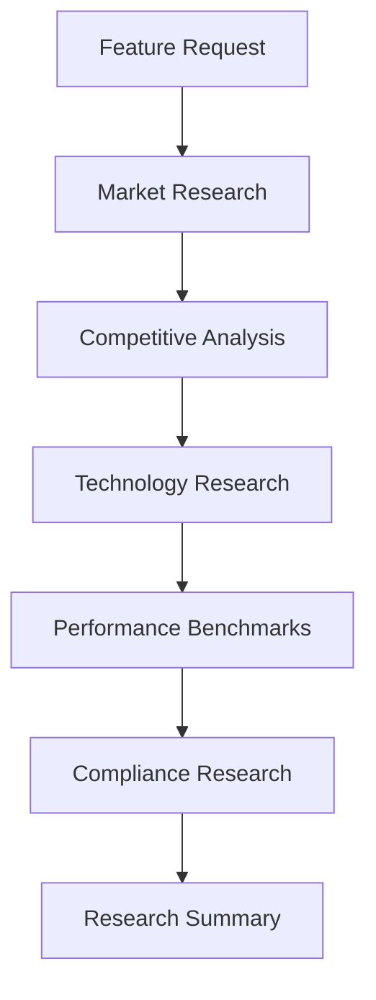
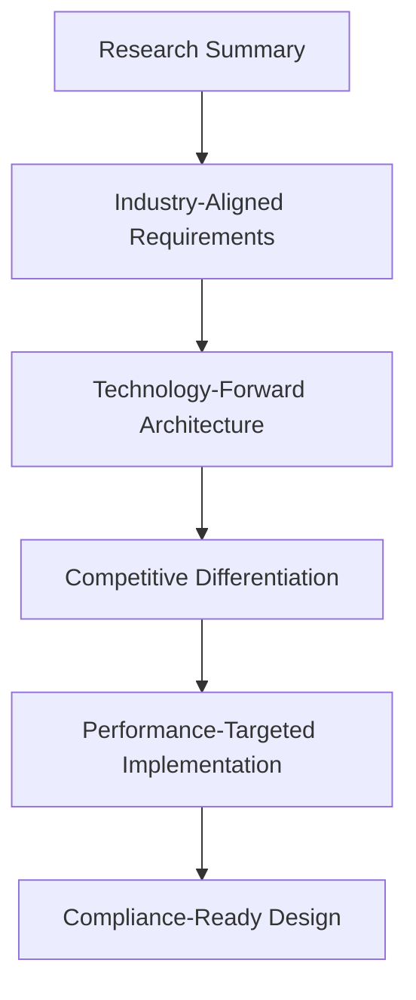
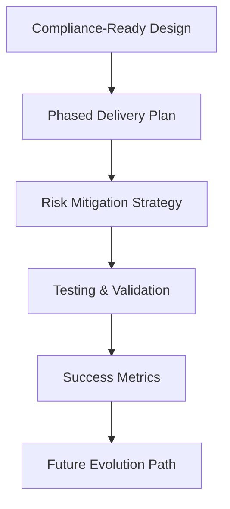

# Feature Planner Comparison: Standard vs Enhanced

## Current Feature Planner Capabilities

### ✅ Strengths
- **Structured Planning**: Provides comprehensive template-based feature plans
- **Technical Detail**: Covers backend, frontend, database, and API requirements
- **Implementation Phases**: Breaks down complex features into manageable phases
- **Testing Strategy**: Includes unit, integration, and E2E testing requirements
- **Risk Assessment**: Identifies potential risks and mitigation strategies

### ⚠️ Limitations
- **Static Knowledge**: Relies on training data without current market research
- **No Competitive Intelligence**: Cannot analyze current competitor offerings
- **Technology Assumptions**: May recommend outdated frameworks or patterns
- **Generic Best Practices**: Applies general practices without industry-specific context
- **No Performance Benchmarks**: Cannot provide current industry performance standards

## Enhanced Feature Planner with Web Research

### 🚀 New Capabilities

#### 1. Real-Time Market Intelligence
```markdown
**Research Phase**: 
- WebSearch: "AI demand forecasting trends 2025"
- WebFetch: Competitor documentation and feature sets
- WebSearch: "inventory management ML benchmarks"
- WebFetch: Latest framework documentation

**Result**: Current market context and competitive positioning
```

#### 2. Technology Research & Recommendations
```markdown
**Technology Intelligence**:
- Latest ML frameworks (Prophet, TensorFlow, PyTorch)
- Current performance benchmarks (<6% MAPE accuracy)
- Modern integration patterns (microservices, event-driven)
- Cloud-native deployment strategies

**Result**: Future-proof technology stack recommendations
```

#### 3. Competitive Analysis & Differentiation
```markdown
**Competitive Research**:
- Centric Software: Enterprise-focused, high complexity
- Cogsy: Mid-market, $299-899/month pricing
- Blue Ridge Global: Supply chain focus

**Result**: Market positioning and differentiation strategy
```

## Side-by-Side Feature Planning Comparison

### Example: AI-Powered Demand Forecasting Feature

| Aspect | Current Planner | Enhanced Planner |
|--------|-----------------|------------------|
| **Market Context** | Generic AI/ML description | Research-backed competitive analysis vs Centric, Cogsy, Blue Ridge |
| **Technology Choice** | "Use machine learning libraries" | Prophet + LSTM hybrid based on 2025 performance studies |
| **Performance Targets** | "Improve accuracy" | <6% MAPE based on industry benchmarks |
| **Architecture** | Basic API/database design | Microservices with circuit breakers, event-driven updates |
| **Implementation** | Generic phases | Research-informed phases with current best practices |
| **Business Value** | General ROI estimates | Industry-specific metrics: 40-60% stockout reduction |

### Research Findings Integration

#### Current Planner Output:
```markdown
## AI-Powered Demand Forecasting Plan

### Overview
- Use machine learning to predict demand
- Improve inventory management accuracy
- Reduce stockouts and overstock

### Technical Requirements
- ML service for predictions
- API endpoints for forecasts
- Database for historical data
```

#### Enhanced Planner Output:
```markdown
## AI-Powered Demand Forecasting - Research-Driven Implementation

### Market Intelligence Summary
- **Industry Trend**: Hybrid Prophet + LSTM models achieving <6% MAPE
- **Competitive Gap**: Current solutions lack SMB accessibility
- **Technology Evolution**: Shift toward cloud-native ML pipelines

### Research-Informed Architecture
- **ML Stack**: Prophet for trend/seasonality + LSTM for complex patterns
- **Performance Target**: <6% MAPE (vs industry average 8-12%)
- **Integration**: Event-driven architecture with circuit breakers
- **Deployment**: Containerized ML service with auto-scaling
```

## Enhanced Planning Process Workflow

### Phase 1: Research & Discovery (NEW)


### Phase 2: Context-Aware Planning


### Phase 3: Implementation Roadmap


## Research Tools Integration Examples

### WebSearch Queries Used
```
Market Research:
- "demand forecasting AI trends 2025"
- "inventory management ML accuracy benchmarks"
- "Prophet vs LSTM time series comparison"

Competitive Intelligence:
- "Centric Software demand planning features"
- "Cogsy inventory forecasting pricing"
- "Blue Ridge supply chain AI capabilities"

Technology Research:
- "microservices ML deployment patterns"
- "event driven architecture ML integration"
- "cloud native ML pipeline best practices"
```

### WebFetch Deep Dives
```
Documentation Analysis:
- Meta Prophet documentation
- TensorFlow Time Series guides
- AWS SageMaker integration patterns
- Azure ML deployment strategies

Industry Reports:
- Gartner Magic Quadrant insights
- Forrester Wave analysis
- Industry analyst predictions
```

## Enhanced Deliverables

### 1. Research Report (NEW)
- **Market Landscape**: Current trends and competitive positioning
- **Technology Assessment**: Modern frameworks and integration patterns
- **Performance Benchmarks**: Industry-standard accuracy and performance targets
- **Compliance Requirements**: Relevant standards and regulations

### 2. Feature Specification (Enhanced)
- **Research-Informed Requirements**: Based on current market needs
- **Industry-Aligned Architecture**: Following current best practices
- **Performance Targets**: Measurable goals based on industry benchmarks
- **Competitive Differentiation**: Unique value propositions identified

### 3. Implementation Strategy (Enhanced)
- **Technology Roadmap**: Future-proof technology selections
- **Integration Patterns**: Modern architectural approaches
- **Performance Optimization**: Based on current optimization techniques
- **Scaling Strategy**: Cloud-native and microservices patterns

## Value Proposition Comparison

| Benefit | Current Planner | Enhanced Planner |
|---------|-----------------|------------------|
| **Time to Market** | Standard development cycles | Accelerated with proven patterns |
| **Technology Risk** | Unknown framework viability | Validated technology choices |
| **Competitive Position** | Generic feature parity | Research-backed differentiation |
| **Performance** | Trial-and-error optimization | Target-driven development |
| **Future-Proofing** | Technology debt risk | Evolution-ready architecture |
| **Business Alignment** | Generic ROI estimates | Industry-specific value metrics |

## Implementation Recommendation

### Short Term (Immediate)
1. **Use Enhanced Planner** for all new feature development
2. **Research-First Approach** for competitive features
3. **Performance Benchmarking** for existing features

### Medium Term (3-6 months)
1. **Retroactive Research** for major existing features
2. **Competitive Intelligence** process establishment
3. **Technology Modernization** based on research findings

### Long Term (6+ months)
1. **Continuous Market Monitoring** for emerging trends
2. **Research-Driven Roadmapping** for strategic planning
3. **Competitive Advantage** through informed decision making

## Conclusion

The Enhanced Feature Planner with web research capabilities transforms feature planning from a static, template-based process to a dynamic, research-informed strategic advantage. By incorporating real-time market intelligence, competitive analysis, and current technology trends, teams can:

- **Reduce Development Risk** through validated technology choices
- **Accelerate Time-to-Market** with proven implementation patterns
- **Achieve Competitive Differentiation** through market gap analysis
- **Deliver Superior Performance** with benchmark-driven targets
- **Future-Proof Architecture** with evolution-ready designs

The investment in research-driven planning pays dividends throughout the development lifecycle and positions products for long-term market success.